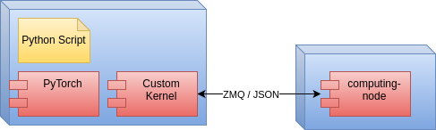

PyTorch Custom CPU Kernel Example
=================================

This repository contains code to study the possibility of implementing PyTorch kernels using a custom backend that benefits from high-speed communication infrastructure.

To simplify the problem:

- A simple kernel that performs additions of tensors restricted to 1xM is implemented.
- ZeroMQ is used instead of the custom middleware.
- Only one executor is implemented.
- There is no optimization.

Requirements
------------

- Ubuntu 20.04.
- [Anaconda/Miniconda](https://www.anaconda.com/).

Installation instructions
-------------------------

Install conda environment:

~~~bash
conda env create -f environment.yml
conda activate pytorch-env
~~~

Build virtual operator node service:

~~~bash
cd virtual_node_service
make
~~~

Build PyTorch custom kernel

~~~bash
cd custom_kernel
pip install .
~~~

Testing
-------

Run the [example jupyter notebook](./tests/CustomKernel.ipynb).

Development notes
-----------------

Update conda environment file:

~~~bash
conda env export > environment.yml
~~~